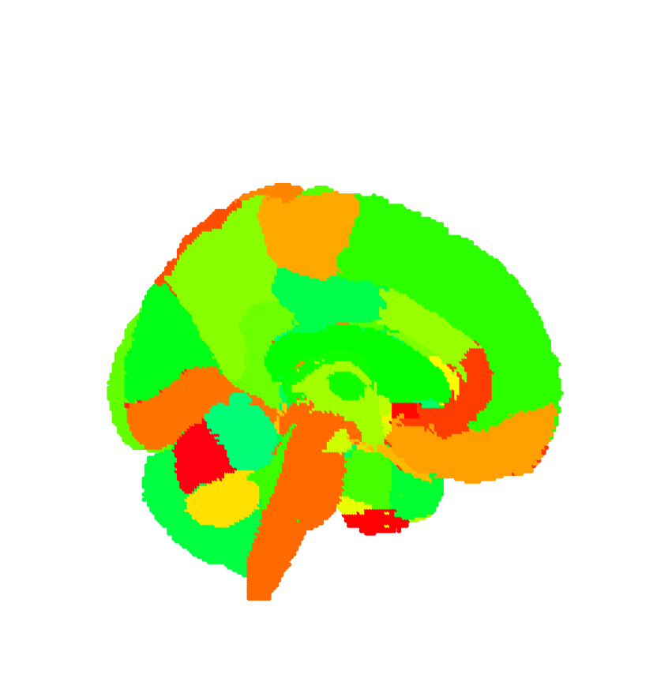
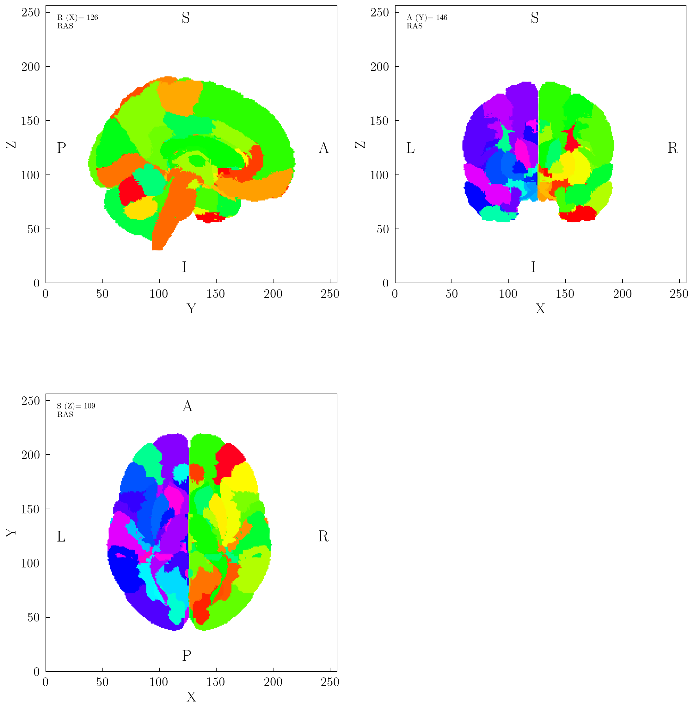
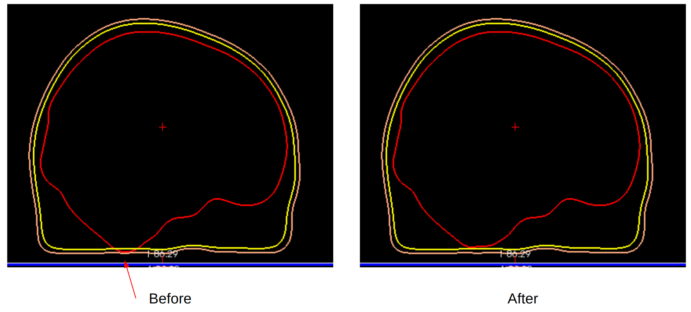

<H1 style="text-align: center;">CerebrA atlas Python</H1>


<b>cerebra_atlas_python</b> offers Python 

<a href="https://nist.mni.mcgill.ca/cerebra/">CerebrA</a> is an accurate non-linear registration of cortical and subcortical labelling from <a href="https://nist.mni.mcgill.ca/cerebra/">Mindboggle 101</a> to the <a href="https://nist.mni.mcgill.ca/cerebra/">symmetric MNI-ICBM2009c atlas</a>. <b>cerebra_atlas_python</b> abstracts the following:


cerebra_atlas_python functionality

abstract coordinate frame transformations

https://nist.mni.mcgill.ca/icbm-152-nonlinear-atlases-2009/

<div style="display:flex;align-items:center;justify-content:center;background-color:aliceblue;padding:25px;flex-direction:column"></img><br/><small>Cerebra Atlas</small></div>

MNIAverage: https://www.dropbox.com/scl/fi/zoff6ihk3711zn6phu2zt/MNIAverage.zip?rlkey=jrg63liehpuhus4suyyfmibuz&dl=0
Cerebra Atlas: https://www.dropbox.com/scl/fi/ivvh2afex6idffmano3qj/10.12751_g-node.be5e62.zip?rlkey=ie3w8lbd5b5377xotsjgnwkrg&dl=0


## USAGE / USE CASES

### Easily access average brain volume. 
Abstract coordinate frames

```
from cerebra_atlas_python import CerebrA
cerebra = CerebrA()
cerebra.orthoview()
```

<div style="display:flex;align-items:center;justify-content:center;padding:25px;flex-direction:column"></img><br/><small>Cerebra Atlas</small></div>


### REQUIREMENTS:

- Python3 + dependencies (TODO)
- Freesurfer (optional)

### INSTALL
Tested for Python 3.10.14

#### Building wheels

```
$ git clone https://github.com/kdotdot/cerebra_atlas_python.git
$ cd cerebra_atlas_python
$ pip install -r requirements.txt
$ pip install --editable .
```

### COMPUTING BRAIN DATA (optional)

The whole data folder generation (cerebra_data) process is outlined in notebooks/0.0-generate-cerebra-data.ipynb

<ol>
  <li>Use Freesurfer to perform cortical reconstruction and generate Boundary Element Model (BEM) surfaces</li>
  <li>Convert CerebrA volume to T1w scan coordinate frame</li>
  <li>Process region metadata</li>
  <li>Manually align fiducials(?) </li>
</ol>

#### Data sources:

Original datasets used to build the processed versions of the volumes.

- [CerebrA](https://gin.g-node.org/anamanera/CerebrA/src/master/): $CEREBRA_DIR
- [ICBM 2009c Nonlinear Symmetric [NIFTI]](https://nist.mni.mcgill.ca/icbm-152-nonlinear-atlases-2009/): $ICBM_DIR

#### Steps:

##### 1) Use Freesurfer to perform cortical reconstruction and generate Boundary Element Model (BEM) surfaces
<ul>
  <li>Perform cortical reconstruction from MRI scan using recon-all</li>

`$ recon-all -subjid icbm152 -i $ICBM_DIR/mni_icbm152_t1_tal_nlin_sym_09c.nii -all`
  <li>Generate boundary element model (BEM) using watershed algoritm</li>
  BEM surfaces were generated using the FreeSurfer watershed algorithm through MNE's `mne.bem.make_watershed_bem`
  <li>Manually edit BEM surfaces </li>
  BEM surfaces are manually edited so that all inner surfaces are contained within the outer surfaces as explained [here](https://mne.tools/stable/auto_tutorials/forward/80_fix_bem_in_blender.html).
  <div style="display:flex;align-items:center;justify-content:center;background-color:aliceblue;padding:25px;flex-direction:column"></img><br/><small>Manual editing of BEM surfaces produced by recon-all</small></div>
</ul>

##### 2) Convert CerebrA volume to T1w scan coordinate frame


###### Convert original .nii into .mgz

CerebrA_in_head.mgz can be computed using Freesurfer and the following commands. Transforms volume from Native anatomical space (193, 229, 193) to Freesurfer space (256, 256, 256):

`$ mri_convert $CEREBRA_DIR"/CerebrA.nii" $CEREBRA_DIR"/CerebrA.mgz"`

###### Transform CerebrA volumne into Freesurfer 'head' (head or mri??) coordinate frame (256x256x256)

`$ mri_vol2vol --mov $CEREBRA_DIR"/CerebrA.mgz" --o $CEREBRA_DIR"/CerebrA_in_head.mgz" --regheader --targ $SUBJECT_DIR/mri/T1.mgz `

##### 3) Process region metadata
|      |Mindboggle ID|Label Name                |CerebrA ID|hemisphere|cortical|color  |
|------|-------------|--------------------------|----------|----------|--------|-------|
|0     |0          |Empty                     |0         |          |        |#000000|
|1     |2027       |Rostral Middle Frontal    |1         |Right     |True    |#ff001e|
|2     |631        |Vermal lobules VI-VII     |2         |Right     |False   |#ff0013|
|3     |2009       |Inferior temporal         |3         |Right     |True    |#ff0003|
|4     |58         |Accumbens Area            |4         |Right     |False   |#ff0700|
|5     |44         |Inferior Lateral Ventricle|5         |Right     |False   |#ff1700|
|6     |2021       |Pericalcarine             |6         |Right     |True    |#ff2200|
|7     |2012       |Lateral Orbitofrontal     |7         |Right     |True    |#ff3200|
|8     |2026       |Rostral Anterior Cingulate|8         |Right     |True    |#ff3d00|
|9     |2029       |Superior Parietal         |9         |Right     |True    |#ff4d00|
|10    |2008       |Inferior Parietal         |10        |Right     |True    |#ff5800|
|11    |16         |Brainstem                 |11        |Right     |False   |#ff6800|
|12    |2013       |Lingual                   |12        |Right     |True    |#ff7300|
|13    |2022       |Postcentral               |13        |Right     |True    |#ff8300|
|14    |2034       |Transverse Temporal       |14        |Right     |True    |#ff8e00|
|15    |2014       |Medial Orbitofrontal      |15        |Right     |True    |#ff9e00|
|16    |2017       |Paracentral               |16        |Right     |True    |#ffa900|
|17    |85         |Optic Chiasm              |17        |Right     |False   |#ffb900|
|18    |2016       |Parahippocampal           |18        |Right     |True    |#ffc400|
|19    |54         |Amygdala                  |19        |Right     |False   |#ffd400|
|20    |632        |Vermal lobules VIII-X     |20        |Right     |False   |#ffdf00|
|21    |51         |Putamen                   |21        |Right     |False   |#ffef00|
|22    |2020       |Pars Triangularis         |22        |Right     |True    |#fffa00|
|23    |2035       |Insula                    |23        |Right     |True    |#f3ff00|
|24    |2007       |Fusiform                  |24        |Right     |True    |#e8ff00|
|25    |92         |Basal Forebrain           |25        |Right     |False   |#d8ff00|
|26    |60         |Ventral Diencephalon      |26        |Right     |False   |#cdff00|
|27    |52         |Pallidum                  |27        |Right     |False   |#bdff00|
|28    |2015       |Middle Temporal           |28        |Right     |True    |#b2ff00|
|29    |14         |Third Ventricle           |29        |Right     |False   |#a2ff00|
|30    |2002       |Caudal Anterior Cingulate |30        |Right     |True    |#97ff00|
|31    |2025       |Precuneus                 |31        |Right     |True    |#87ff00|
|32    |2018       |Pars Opercularis          |32        |Right     |True    |#7cff00|
|33    |2010       |Isthmus Cingulate         |33        |Right     |True    |#6cff00|
|34    |2011       |Lateral Occipital         |34        |Right     |True    |#61ff00|
|35    |2024       |Precentral                |35        |Right     |True    |#56ff00|
|36    |2006       |Entorhinal                |36        |Right     |True    |#46ff00|
|37    |15         |Fourth Ventricle          |37        |Right     |False   |#3bff00|
|38    |2028       |Superior Frontal          |38        |Right     |True    |#2bff00|
|39    |46         |Cerebellum White Matter   |39        |Right     |False   |#20ff00|
|40    |49         |Thalamus                  |40        |Right     |False   |#10ff00|
|41    |43         |Lateral Ventricle         |41        |Right     |False   |#05ff00|
|42    |2003       |Caudal Middle Frontal     |42        |Right     |True    |#00ff0a|
|43    |2005       |Cuneus                    |43        |Right     |True    |#00ff15|
|44    |2019       |Pars Orbitalis            |44        |Right     |True    |#00ff25|
|45    |2030       |Superior Temporal         |45        |Right     |True    |#00ff30|
|46    |45         |Cerebellum Gray Matter    |46        |Right     |False   |#00ff40|
|47    |2023       |Posterior Cingulate       |47        |Right     |True    |#00ff4b|
|48    |53         |Hippocampus               |48        |Right     |False   |#00ff5b|
|49    |50         |Caudate                   |49        |Right     |False   |#00ff66|
|50    |630        |Vermal lobules I-V        |50        |Right     |False   |#00ff76|
|51    |2031       |Supramarginal             |51        |Right     |True    |#00ff81|
|52    |1027       |Rostral Middle Frontal    |52        |Left      |True    |#00ff91|
|53    |631        |Vermal lobules VI-VII     |53        |Left      |False   |#00ff9b|
|54    |1009       |Inferior temporal         |54        |Left      |True    |#00ffac|
|55    |58         |Accumbens Area            |55        |Left      |False   |#00ffb6|
|56    |44         |Inferior Lateral Ventricle|56        |Left      |False   |#00ffc6|
|57    |1021       |Pericalcarine             |57        |Left      |True    |#00ffd1|
|58    |1012       |Lateral Orbitofrontal     |58        |Left      |True    |#00ffe1|
|59    |1026       |Rostral Anterior Cingulate|59        |Left      |True    |#00ffec|
|60    |1029       |Superior Parietal         |60        |Left      |True    |#00fffc|
|61    |1008       |Inferior Parietal         |61        |Left      |True    |#00f6ff|
|62    |16         |Brainstem                 |62        |Left      |False   |#00e6ff|
|63    |1013       |Lingual                   |63        |Left      |True    |#00dbff|
|64    |1022       |Postcentral               |64        |Left      |True    |#00caff|
|65    |1034       |Transverse Temporal       |65        |Left      |True    |#00c0ff|
|66    |1014       |Medial Orbitofrontal      |66        |Left      |True    |#00afff|
|67    |1017       |Paracentral               |67        |Left      |True    |#00a4ff|
|68    |85         |Optic Chiasm              |68        |Left      |False   |#0094ff|
|69    |1016       |Parahippocampal           |69        |Left      |True    |#0089ff|
|70    |54         |Amygdala                  |70        |Left      |False   |#007eff|
|71    |632        |Vermal lobules VIII-X     |71        |Left      |False   |#006eff|
|72    |51         |Putamen                   |72        |Left      |False   |#0063ff|
|73    |1020       |Pars Triangularis         |73        |Left      |True    |#0053ff|
|74    |1035       |Insula                    |74        |Left      |True    |#0048ff|
|75    |1007       |Fusiform                  |75        |Left      |True    |#0038ff|
|76    |92         |Basal Forebrain           |76        |Left      |False   |#002dff|
|77    |60         |Ventral Diencephalon      |77        |Left      |False   |#001dff|
|78    |52         |Pallidum                  |78        |Left      |False   |#0012ff|
|79    |1015       |Middle Temporal           |79        |Left      |True    |#0001ff|
|80    |14         |Third Ventricle           |80        |Left      |False   |#0800ff|
|81    |1002       |Caudal Anterior Cingulate |81        |Left      |True    |#1900ff|
|82    |1025       |Precuneus                 |82        |Left      |True    |#2400ff|
|83    |1018       |Pars Opercularis          |83        |Left      |True    |#3400ff|
|84    |1010       |Isthmus Cingulate         |84        |Left      |True    |#3f00ff|
|85    |1011       |Lateral Occipital         |85        |Left      |True    |#4f00ff|
|86    |1024       |Precentral                |86        |Left      |True    |#5a00ff|
|87    |1006       |Entorhinal                |87        |Left      |True    |#6a00ff|
|88    |15         |Fourth Ventricle          |88        |Left      |False   |#7500ff|
|89    |1028       |Superior Frontal          |89        |Left      |True    |#8500ff|
|90    |46         |Cerebellum White Matter   |90        |Left      |False   |#9000ff|
|91    |49         |Thalamus                  |91        |Left      |False   |#a100ff|
|92    |43         |Lateral Ventricle         |92        |Left      |False   |#ac00ff|
|93    |1003       |Caudal Middle Frontal     |93        |Left      |True    |#bc00ff|
|94    |1005       |Cuneus                    |94        |Left      |True    |#c700ff|
|95    |1019       |Pars Orbitalis            |95        |Left      |True    |#d700ff|
|96    |1030       |Superior Temporal         |96        |Left      |True    |#e200ff|
|97    |45         |Cerebellum Gray Matter    |97        |Left      |False   |#f200ff|
|98    |1023       |Posterior Cingulate       |98        |Left      |True    |#fd00ff|
|99    |53         |Hippocampus               |99        |Left      |False   |#ff00f0|
|100   |50         |Caudate                   |100       |Left      |False   |#ff00e5|
|101   |630        |Vermal lobules I-V        |101       |Left      |False   |#ff00d4|
|102   |1031       |Supramarginal             |102       |Left      |True    |#ff00ca|
|103   |0          |White matter              |103       |          |        |#ffdddd|


### TODOS:

- Update README
- Create documentation page
- Create backup of data sources
- Publish library
  -> Get DOI
  -> Create python dependencies file
  -> Upload to pip
