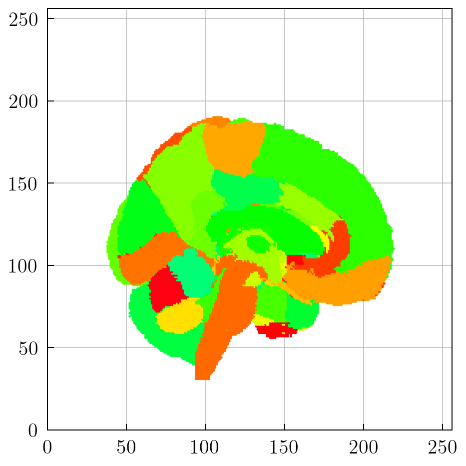
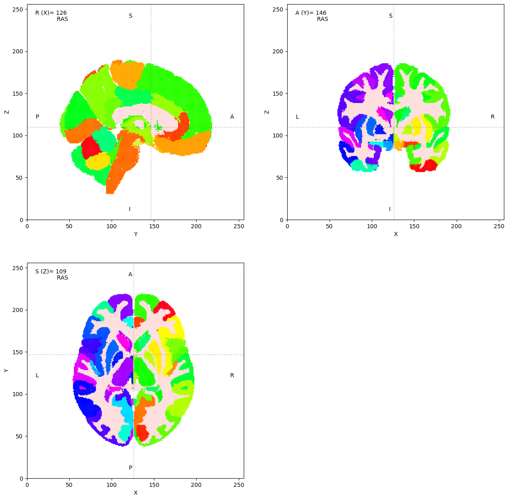

cerebra-atlas-python functionality

abstract coordinate frame transformations

CerebrA is an accurate non-linear registration of cortical and subcortical labelling from Mindboggle 101 to the symmetric MNI-ICBM2009c atlas followed by manual editing.

<div style="display:flex;align-items:center;justify-content:center;background-color:aliceblue;padding:25px;flex-direction:column"></img><br/><small>Cerebra Atlas</small></div>

MNIAverage: https://www.dropbox.com/scl/fi/zoff6ihk3711zn6phu2zt/MNIAverage.zip?rlkey=jrg63liehpuhus4suyyfmibuz&dl=0
Cerebra Atlas: https://www.dropbox.com/scl/fi/ivvh2afex6idffmano3qj/10.12751_g-node.be5e62.zip?rlkey=ie3w8lbd5b5377xotsjgnwkrg&dl=0

### REQUIREMENTS:

- Python3 + dependencies (TODO)
- Freesurfer (optional)

### USAGE / USE CASES

```
from cerebra-atlas-python import CerebrA
cerebra = CerebrA()
cerebra.orthoview()
```

<div style="display:flex;align-items:center;justify-content:center;padding:25px;flex-direction:column"></img><br/><small>Cerebra Atlas</small></div>

### INSTALL

#### Building wheels

```
$ git clone https://github.com/kdotdot/cerebra-atlas-python.git
$ cd cerebra-atlas-python
$ pip install -r requirements.txt
$ pip install build
$ pip install build
$ pip install .
```

### BUILDING SURFACES (optional)

How to build CerebrA_in_head.mgz
This step is optional because the CerebrA class will automatically download the processed files from [GDrive](https://drive.google.com/drive/folders/1wFic-Td5LvuuwPpqg9XXilh8TqiV1MRl).

##### Datasets:

Original datasets used to build the processed versions of the volumes.

- [CerebrA](https://gin.g-node.org/anamanera/CerebrA/src/master/): $CEREBRA_DIR
- [ICBM 2009c Nonlinear Symmetric [NIFTI]](https://nist.mni.mcgill.ca/icbm-152-nonlinear-atlases-2009/): $ICBM_DIR

##### Cortical reconstruction of ICBM 2009c Nonlinear Symmetric:

[MNIAverage.zip](https://drive.google.com/file/d/1KIy6MQVYeZxHl1AhhRHHDZI0OQUxZR8M/view?usp=sharing) ($SUBJECT_DIR): **ICBM 2009c NLS cortical reconstruction folder (freesurfer subject)**: Includes ouputs for recon-all command as well as manually edited BEM surfaces.

MNIAverage was generated by running `$ recon-all` command from FreeSurfer:

`$ recon-all -subjid MNIAverage -i $ICBM_DIR/mni_icbm152_t1_tal_nlin_sym_09c.nii -all`

BEM surfaces were generated using the FreeSurfer watershed algorithm through MNE's `mne.bem.make_watershed_bem` and then manually edited so that all inner surfaces are contained within the outer surfaces as explained [here](https://mne.tools/stable/auto_tutorials/forward/80_fix_bem_in_blender.html).

<div style="display:flex;align-items:center;justify-content:center;background-color:aliceblue;padding:25px;flex-direction:column"></img><br/><small>Manual editing of BEM surfaces produced by recon-all</small></div>

##### Coordinate frame alignment for the CerebrA atlas

###### Convert original .nii into .mgz

CerebrA_in_head.mgz can be computed using Freesurfer and the following commands. Transforms volume from Native anatomical space (193, 229, 193) to Freesurfer space (256, 256, 256):

`$ mri_convert $CEREBRA_DIR"/CerebrA.nii" $CEREBRA_DIR"/CerebrA.mgz"`

###### Transform CerebrA volumne into Freesurfer 'head' coordinate frame (256x256x256)

`$ mri_vol2vol --mov $CEREBRA_DIR"/CerebrA.mgz" --o $CEREBRA_DIR"/CerebrA_in_head.mgz" --regheader --targ $SUBJECT_DIR/mri/T1.mgz `

### TODOS:

- Update README
- Create documentation page
- Publish library
  -> Get DOI
  -> Create python dependencies file
  -> Upload to pip
